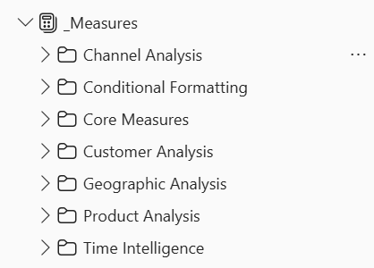

# Mobile Sales and Trends Analysis 2024

### Note: 

This repository outlines the full technical process used in the analysis. Key business insights and recommendations are provided at the end, with a comprehensive report available in this folder and on my website: www.primepeakinsights.com

## Table of Contents

This repository is structured to walk you through the full end-to-end process of the Mobile Sales and Trends Analysis, from the initial business problem through to the final insights and reflections. Each section builds on the previous one, following the same logical flow used to plan and execute the analysis itself.

1. [Project Overview](#project-overview)
2. [Tools and Technologies](#tools-and-technologies)
3. [The SCAN Framework](#the-scan-framework)
4. [Project Phases](#project-phases)
5. [Insights for the Business](#insights-for-the-business)
6. [In Hindsight](#in-hindsight)
7. [Concluding notes](#concluding-notes)
---

## 1. Project Overview

In 2024, a mobile phone retailer operating across 4 countries (India, Turkey, Bangladesh, and Pakistan) lacked a centralised view of its sales performance. Key data such as revenue, product mix, customer demographics, and channel performance, existed in raw transactional formats, making it difficult to extract meaningful insights or support decision-making.

As a result, stakeholders were unable to answer critical business questions, such as:

* Which markets were driving the most revenue?
* What products performed best across different regions?
* Which sales channels were most effective?

This project was built to bridge that gap by transforming a partially modelled Excel dataset into a structured, end-to-end Power BI analytics solution. The goal was to enable clear visibility into performance, support data-driven decision-making, and uncover actionable insights across markets, products, and customer segments.


---

## 2. Tools and Technologies

The following tools and technologies were used to complete this analysis:

| Tool | Purpose |
|---|---|
| Microsoft Excel | Dataset inspection and preliminary diagnosis |
| Power BI Desktop | Data modelling, DAX measures, and report building |
| Power Query | Data transformation and normalisation; Calendar table generation |
| DAX | 65 measures across 7 display folders |
| Figma | Wireframing and report background design |
| JSON | Custom Emerald Tide theme applied across all 26 visual types |

---

## 3. The SCAN Framework

This analysis was planned and executed using the SCAN Framework, a personal structured methodology developed to bring clarity to every stage of the process.

| Step | Description |
|---|---|
| S - Scope the Situation | - Defined the business problem and the cost of inaction. <br><br> - **HOW?** The retailer had no centralised view of performance across 4 markets, making it impossible to identify which brands, channels, or regions were driving revenue. Resulting in an inability to act on pricing trends or demographic shifts in real time. |
| C - Confirm the Core Metrics | - Established North Star metric (Revenue), and 3 Catalysts (Average Selling Price, Units Sold, and Transactions). <br><br> - **HOW?** Mapped the Indicators under each Catalyst to explain why each one moved, and to give the report a clear diagnostic layer. |
| A - Build the Architecture | - Normalised the raw dataset and built a star schema with 4 tables, 3 manually built relationships, and 65 DAX measures organised into display folders. <br><br> - **HOW?** Every technical decision, from the composite Product Key to the Power Query Calendar table, was made to support the metric hierarchy confirmed in the C step. |
| N - Narrate the Story | - Wireframed all 6 report pages before opening Figma, then designed all backgrounds in Figma and exported them as PNG canvas images into Power BI. <br><br> - **HOW?** Applied the Emerald Tide JSON theme across all 26 visual types and used cohesion, aesthetic, rhythm, and emphasis to ensure design decisions served the story the data was telling. |

---

## 4. Project Phases

A structured, end-to-end workflow was followed to transform raw unstructured transactional data into a scalable and insight-driven Power BI solution. The project spans data preparation, modelling, optimisation, and dashboard design, with each phase building toward actionable business insights.

### PHASE 1: Data Preparation (Excel)
Steps:
- Reviewed the raw `Mobile_Sales.xlsx` file across 4 sheets: Fact\_Sales, Dim\_Products, Dim\_Locations, and Data Dictionary
- Rebinned `Customer_Age_Group` from 6 bands to 4 equal 12-year bands: 18-29, 30-41, 42-53, 54-65
- Normalised `Fact_Sales` by removing 7 denormalised columns: Brand, Operating\_System, Color, Storage\_Size, Country, Latitude, Longitude
- Replaced GUID-based `Transaction_ID` with sequential integers 1 to 366
- Created composite `Product_Key` (P001 to P274) in both Dim\_Products and Fact\_Sales to enable a valid one-to-many relationship

**Data prep image:**


## Characteristics of the dataset

| Property | Detail |
|---|---|
| Source | Mobile\_Sales.xlsx |
| Period | January 1 to December 31, 2024 |
| Transactions | 366 |
| Brands | 5 (Apple, Samsung, Google, OnePlus, Xiaomi) |
| Models | 19 |
| Countries | 4 (India, Turkey, Bangladesh, Pakistan) |
| Cities | 25 |
| Currency | Native dataset unit - denomination unspecified |

---

### PHASE 2: Data Model Setup (Power BI)
Steps:
- Loaded 3 tables into Power BI via Power Query, fixing a promoted headers issue on Dim\_Products
- Disabled auto-detect relationships for complete manual control
- Built a star schema with 3 active relationships: DIM_Products, DIM_Locations, and DIM_Calendar each connected one-to-many to FACT_Sales.
- Created DIM\_Calendar in Power Query with 11 columns covering all 366 days of 2024
- Marked DIM\_Calendar as the official date table

### Data Model Layout
The data model in this analysis consisted of 3 key areas: tables, star schema, and relationships.

#### 1) Tables 

This is a summary of the table structure:

| Table | Rows | Columns | Description |
|---|---|---|---|
| FACT\_Sales | 366 | 13 | Central fact table - transactions, measures, and foreign keys |
| DIM\_Products | 274 | 6 | Product variants by model, brand, OS, storage, and colour |
| DIM\_Locations | 25 | 4 | City, country, latitude, and longitude |
| DIM\_Calendar | 366 | 11 | Date table built in Power Query |
| \_Measures | 0 | - | Dedicated measures table with 65 DAX measures |

#### 2) Star Schema

This is a summary of the data model's star schema layout:

```
FACT_Sales (366 rows, 13 columns)
    |
    |-- DIM_Products (274 rows, 6 columns)      [via Product_Key]
    |-- DIM_Locations (25 rows, 4 columns)      [via City]
    |-- DIM_Calendar (366 rows, 11 columns)     [via Transaction_Date]
```

This image below shows all the above mentioned components of this data model in a logical star schema design. 
It illustrates the relationship between the central FACT_Sales table and supporting dimension tables, structured to enable scalable and efficient analytical reporting.


#### 3) Relationships
This is a summary of the relationship cardinality:

| From | To | Column | Cardinality |
|---|---|---|---|
| DIM_Products | FACT_Sales | Product_Key | One to Many |
| DIM_Locations | FACT_Sales | City | One to Many |
| DIM_Calendar | FACT_Sales | Transaction_Date | One to Many |

#### Data Model Performance

The data model is structured as a star schema with one central fact table (FACT_Sales) and 3 dimension tables (DIM_Products, DIM_Locations, and DIM_Calendar), built from a partially modelled Excel source file. The model covers 366 transactions across 4 countries, 25 cities, 5 brands, and 19 mobile phone models, with 65 DAX measures organised into 7 display folders.

**This data model allows this analysis to:**

- Track Revenue (14,525,413), Units Sold (18,548), and Transactions (366) at transaction level and aggregate across any combination of brand, model, country, city, age group, gender, sales channel, and payment type.
- Analyse month-over-month performance for all 5 core metrics using time intelligence measures built on a Power Query Calendar table.
- Compare average selling price across countries, brands, age groups, and genders - surfacing pricing gaps such as Pakistan at 619 versus the overall average of 784.
- Drill down from country to city level using the Geography hierarchy, from brand to model to storage to colour using the Product hierarchy, and from year to day using the Date hierarchy.
- Apply conditional formatting dynamically across visuals to surface the highest and lowest performing months, brands, and metrics without manual configuration.
  
---

### PHASE 3: Model Optimisation
Steps:
- Created 65 DAX measures organised into 7 display folders in a dedicated `_Measures` table
- Standardised all column naming conventions to underscore format
- Hidden all foreign key and join columns from report view
- Added descriptions to all 79 model objects including tables, columns, and measures
- Built 3 user hierarchies: Date, Geography, and Product
- Corrected data types: Transaction\_ID changed to Text, date columns changed from DateTime to Date

#### Measures Organisation and Model Optimisation



---

### PHASE 4: Report Building (Power BI)

Built 6 report pages following the North Star to Catalyst to Indicator hierarchy:

| Page | Name | Role |
|---|---|---|
| 1 | Executive Overview | North Star |
| 2 | The 3 Catalysts | Catalysts |
| 3 | Product Performance | Product Indicators |
| 4 | Geographic Analysis | Geographic Indicators |
| 5 | Customer Insights | Customer Indicators |
| 6 | Channel and Payment | Channel Indicators |

---

### PHASE 5: Design and Theme
Steps:
- Designed all 6 report page backgrounds in Figma, exported as PNG images, and imported as canvas backgrounds in Power BI
- Applied the custom Emerald Tide JSON theme across all 26 visual types
- Applied cohesion, aesthetic, rhythm, emphasis considerations throughout the report


---

<!--
## Measures Library

65 DAX measures organised across 6 display folders:

| Folder | Count | Key Measures |
|---|---|---|
| Core Measures | 5 | Total Revenue, Total Units Sold, Total Transactions, Average Selling Price, Average Units per Transaction |
| Time Intelligence | 23 | PM, MoM Change, MoM %, and YTD variants for all core measures, plus vs Last Month comparisons |
| Product Analysis | 6 | Revenue by Brand, Revenue by Model, Revenue by OS, Units by Storage, Units by Color, Avg Revenue per Brand |
| Customer Analysis | 6 | Revenue and Units by Age Group and Gender, Avg Selling Price by Age Group and Gender |
| Geographic Analysis | 5 | Revenue and Units by Country and City, Avg Selling Price by Country |
| Channel Analysis | 5 | Revenue, Units, and Transactions by Sales Channel and Payment Type |
| Conditional Formatting | 15 | CF Revenue by Brand, CF Bars, Marker Color, MoM Revenue, CF MoM Revenue, and supporting measures |
-->

## 5. Insights for the business

This section translates key analytical findings into clear, actionable strategies that directly support revenue growth. It enables the business to make data-driven decisions by highlighting where to focus resources for the greatest commercial impact moving forward.

| Key Insights | Recommendations | Business Impact |
|---|---|---|
| 14.5M revenue across 366 transactions in 2024 | Prioritise India as the primary growth market. Increase stock depth and channel presence in key Indian cities, particularly Chennai and beyond. | ✓ India generates 48% of total revenue (6.97M) and 46% of total units sold.<br><br>✓ A 10% increase in Indian market revenue alone would add approximately 697K to the top line, more than the entire Pakistan market. |
| Apple (3.64M) and Samsung (3.48M) dominate brand performance | Increase the availability and visibility of Apple and Samsung products across all markets. | ✓ Apple and Samsung together generate 49% of total revenue despite representing just 2 of 5 brands.<br><br>✓ They also have the highest average selling prices, meaning a shift in brand mix toward these two brands lifts the North Star without requiring additional transactions. |
| September revenue dips below 1M (988K) | Launch a targeted promotional campaign ahead of and during September to address the annual mid-year revenue dip. | ✓ September is the only month in 2024 that fell below the 1M revenue threshold, recording 988K.<br><br>✓ A modest 5% revenue uplift in September alone would recover approximately 50K and restore all 12 months above the threshold. |
| Pakistan ASP is 619 (27% below average) | Conduct a strategic review of the Pakistan market, focusing on product range realignment and pricing optimisation. | ✓ Pakistan records an average selling price of 619, which is 27% below the overall average of 784.<br><br>✓ Aligning Pakistan's product mix and pricing closer to Bangladesh's profile (average 736) could increase Pakistan's revenue contribution by an estimated 65% without requiring a larger customer base. |
| Online channel drives 62.3% of revenue | Continue investing in and expanding the Online channel as the primary revenue driver. | ✓ Online generates 62.3% of total revenue and the highest average units per transaction at 52.7, compared to 43.5 for the Partner channel.<br><br>✓ Shifting 10 Partner transactions to Online would generate an estimated 930 additional units, based on the differential in average transaction size. |
| 54–65 age group has highest spend (831) | Develop targeted marketing and product strategies for the 54 to 65 age segment, particularly around Apple products. | ✓ The 54 to 65 age group records the highest average spend at 831 per device and the strongest preference for Apple.<br><br>✓ This segment represents the highest value customer cohort in the business. Increasing their transaction volume by 10% would generate approximately 309K in additional revenue based on current average spend. |

---

## 6. In Hindsight

This analysis covers the full scope of the 2024 dataset as it was provided. Looking back, there are areas I would expand in a future iteration to make the solution more complete.

**Additional Metrics:**
- Net Revenue after returns to give the business a more accurate picture of true performance.
- Customer Lifetime Value by age group to quantify the long-term revenue contribution of the 54 to 65 segment.
- Market penetration rate by country to contextualise each market's revenue against its total addressable opportunity.

**How I Would Evolve the Data Model:**
- A dedicated DIM_Customers table to enable deeper customer-level analysis, as demographic attributes such as Customer_Age, Customer_Age_Group, and Customer_Gender are currently stored in FACT_Sales rather than in a dedicated dimension table.
- Extend DIM_Calendar to support rolling 12-month analysis across years, not just the 2024 calendar year.
- A Promotions table to track the impact of pricing decisions on average selling price over time.

**Building a More Robust Pipeline:**
- Replace the static Excel source file with a live database connection to enable scheduled or real-time data refresh.
- Introduce data validation checks at the Power Query stage to catch inconsistencies before they reach the model.
- Automate the normalisation process using a data pipeline so future datasets load clean without manual preparation.

---

## 7. Concluding notes

The interactive dashboard of this project can be viewed [here](https://bit.ly/4trOdf8).   
For any inquiries, reach out to the author through the information provided below.

---

## Author

**Kirby Phillips**

Power BI Data Analyst | 
[LinkedIn](https://www.linkedin.com/in/kirbykphillips/) | [Website](https://www.primepeakinsights.com)

